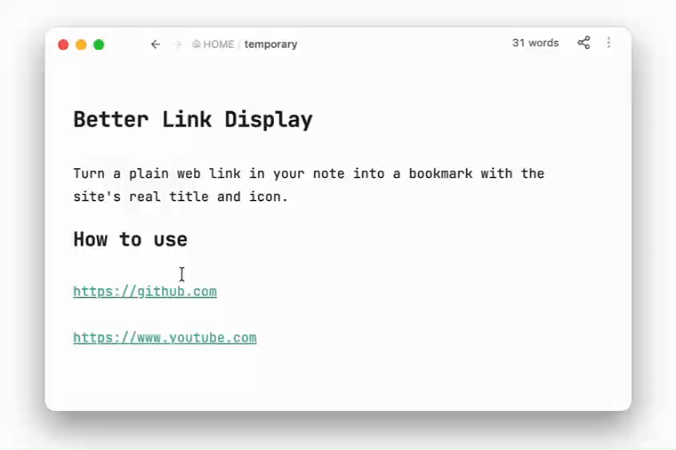

# Better Link Display

Turn a plain web link in your note into a bookmark with the site's real title and icon.

把笔记里的网址一键变成带网站标题和图标的书签。



It's still an ordinary Markdown link — the icon is inlined as text, so the bookmark keeps working with the plugin disabled, in another vault, or in any other Markdown app.

它依然是普通的 Markdown 链接——图标以文本形式内嵌，所以即使停用插件、换个库或换个 Markdown 应用，书签照样正常显示。

## Install

**Community plugins** → **Browse** → search *Better Link Display* → Install → Enable.

Requires Obsidian 1.13+, desktop and mobile.

## Setup

Titles come from a small online service, [Bookmarkify](https://bookmarkify.cc), so you need a free token once:

1. Sign in at [bookmarkify.cc](https://bookmarkify.cc) and create a token.
2. Paste it into **Settings → Better Link Display → Access token**.
3. Click **Test**.

The token is read-only — it can only look up a page's title and icon.

## Use

In editing mode, hover a link and click **Format**. Works with all three forms:

```
https://example.com
[Example](https://example.com)
<https://example.com>
```

No mouse (or on mobile)? Put the cursor in the link and run **Format link under cursor** from the command palette.

Hovering an already-formatted link gives **Reformat** (look it up again) and **Reset** (strip the icon, leaving `[Title](url)` — instant and offline).

If a lookup fails, a notice explains why and your note is left untouched.

## Settings

| Setting | |
| --- | --- |
| **Language** | English / 中文, following Obsidian by default. |
| **Preview** | Live sample of the two options below. |
| **Background** | Soft grey card behind formatted links. Off by default. |
| **Border** | Light outline around formatted links. Off by default. |
| **Access token** | Your lookup key, with a **Test** button. |

Background and Border are purely visual and change nothing in your notes.

## Notes

- No Format button appears in Reading view, inside code blocks or frontmatter, or on image embeds.
- A bare URL containing brackets — `https://en.wikipedia.org/wiki/Foo_(bar)` — is skipped, since Markdown can't tell where it ends. Wrap it in `<…>` or write it as `[text](url)`.
- Because the icon is inlined, formatted lines look long in Source mode (~1,300–4,800 characters per icon). Live Preview and Reading view show only the icon and title.
- Nothing is sent anywhere until you click **Format**: one lookup request, one icon download (`https` images only).
- The **Format link under cursor** command name only changes language after a restart.


## License

MIT
